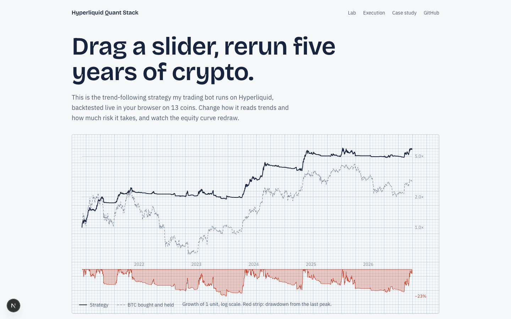
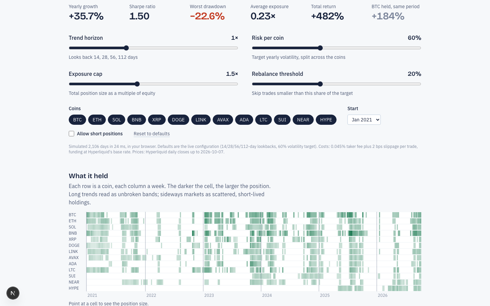
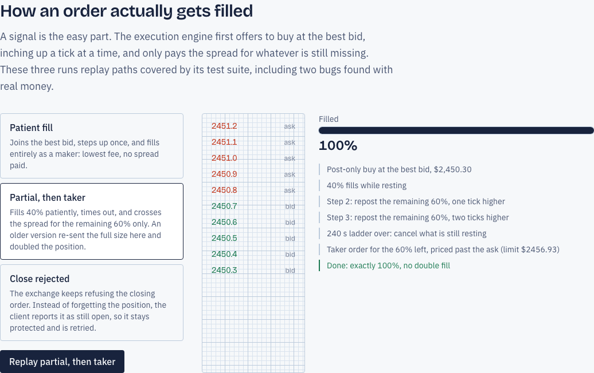

# Hyperliquid Quant Stack

The open-source half of the trading bot I run on [Hyperliquid](https://hyperliquid.xyz): the order
execution engine, a trend-following strategy you can backtest in your browser, and the story of a
backtest that was off by a factor of fourteen.

**Live demo: [hyperliquid-quant-stack.vercel.app](https://hyperliquid-quant-stack.vercel.app)**



## What's inside

| Path | What it is |
|---|---|
| [`apps/lab`](apps/lab) | Next.js app. Strategy Lab (backtest in a Web Worker, shareable URL state), position map, an animated replay of how orders get filled, and the case study below. |
| [`packages/hl-exec`](packages/hl-exec) | `@andreaaca/hl-exec`: production order execution for Hyperliquid perps. 61 tests. |
| [`packages/trend-ensemble`](packages/trend-ensemble) | `@andreaaca/trend-ensemble`: target weights, a backtester that runs anywhere, and a paper-trading runner. Matches the Python research engine to 1e-10. |
| [`research`](research) | The Python robustness study the strategy's parameters come from. |

The live bot imports both packages from npm, so the code here is the code that trades.

## The backtest said +87%

After four months of live trading, the bot's own backtest engine said the same period should have
returned **+87%**. The account had made **+6%**.

Matching trades one by one showed they weren't even running the same strategy: only **9 of 53**
simulated entries had a live counterpart. The engine read spot-exchange volume while the bot trades
perpetuals, and it built its 30-minute bars by counting rows of 1-minute data, so every gap in the
data shifted the bars off the clock. With volume-gated signals, both differences matter.

So I built a replay that runs the bot's real signal code over the venue's own historical candles. It
reproduces **46 of 48** live entries, and it is now the only backtest I trust. Run against it, the
most heavily optimised strategy (143 tuned parameters) lost money out of sample. Removing two noisy
signals made it profitable, and that was confirmed on years it had never been tuned on.

The trend ensemble in this repo goes the other way: six textbook parameters, none fitted, the same
result on two independent data sources, and a TypeScript port that reproduces the Python research
engine exactly. It is what the Lab runs.



## Execution, not just signals

`HyperliquidExecutor` is what turns a signal into a position without leaking money:

- **Maker-first ladder.** It posts at the best bid, steps one tick closer per interval, then
  crosses the spread only for the size still missing. An earlier version re-sent the full size after
  a partial fill and could double a position. That is now a regression test.
- **Closes that can't silently fail.** Reduce-only orders are retried on the on-chain remainder.
  When a share is still open, the client throws `CloseFailedError` instead of returning "nothing to
  close", so the caller keeps the position, its stop-loss and its take-profit.
- **Native TP/SL.** Hyperliquid acknowledges trigger orders without an order id, so the ids are
  recovered from the open-orders book. Without that they can't be cancelled or audited.
- **Accounting.** Fees come from real fills (WebSocket cache, REST fallback), and funding comes from
  the venue's history. Leverage is set per coin, and sub-accounts are signed with the same agent key.



## Run it

```bash
pnpm install
pnpm test                         # package test suites
pnpm --filter lab fetch-data      # Hyperliquid daily closes -> apps/lab/public/data
pnpm --filter lab dev             # http://localhost:3000
python3 research/trend_ensemble_backtest.py   # the research report (needs numpy, pandas)
```

```ts
import { HyperliquidExecutor } from '@andreaaca/hl-exec';
import { DEFAULT_TREND_PARAMS, runBacktest } from '@andreaaca/trend-ensemble';
```

## What's not here

The bot's other two strategies, their parameters, the multi-tenant SaaS around it, and anything
tied to a real account stay private. This repo shows the reusable parts and the method.

Nothing here is financial advice. Backtests are not predictions; the case study above is about
exactly that.

## License

MIT
